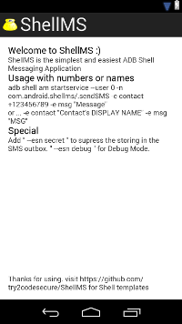

 ShellMS 
=======

ShellMS - Android Debug Bridge Shell SMS Application

ShellMS is the simplest and easiest ADB Shell Messaging Application.
If you don't know what ADB or SDK is you definitely don't need this app.
For the others it's useful tool to speed up messaging when you're working on your computer.

Download => APK is availible on F-Droid:
 * http://f-droid.org/repository/browse/?fdid=com.android.shellms

Usage:
 * with mobile phone numbers:
	- adb shell am startservice --user 0 -n com.android.shellms/.sendSMS -e contact +123456789 -e msg "Message"
 * with display names from phone:
	- adb shell am startservice --user 0 -n com.android.shellms/.sendSMS -e contact "Contact's DISPLAY NAME" -e msg "MSG"

Special features:
 * Secret SMS (don't store sms in outbox; useful when you send many sms):
	- append " --esn secret " to the end of the service call above

Hints / Notes:
 * If you're using a new cyanogenmod version => ! disable Privacy Guard for ShellMS !
(otherwise the app can't search in your phonebook for the contact-names)
 * When you use the app with names, the programm will only searching if it matches the phone's DisplayName from your contact.
If the name matches then it searches ONLY for mobile phone numbers. Other numbers will not be processed.

Used permissions:
 * android.permission.SEND_SMS => surprisingly to send sms
 * android.permission.READ_SMS => to store in the outbox
 * android.permission.WRITE_SMS => to store in the outbox
 * android.permission.READ_CONTACTS => to get the names from the phone

Templates:
 * simple shell ""
 * for multiple contacts ""
 * if you need more scripts => https://github.com/fbreitwieser/sendsms-scripts
	perl scripts with improved contacts querying and displays recent conversations (GPLv2), thanks to Florian Breitwieser

Donation / Spenden (via Bitcoin):
 * Bitcoins will be really appreciated: 1Mqdg9HAfLiPconDcEmsvdGoS6YeALMrdJ

Changelog:

v1.1 (20130704)
 * fixed crash when sending long SMS
 * improved shell template

v1.0 (20130425)
 * first release

License: GPLv3+

    ShellMS - Android Debug Bridge Shell SMS Application
    Copyright (C) 2013 by Rainer
    is101024@fhstp.ac.at
    https://github.com/try2codesecure/ShellMS
	
    This program is free software: you can redistribute it and/or modify
    it under the terms of the GNU General Public License as published by
    the Free Software Foundation, either version 3 of the License, or
    any later version.

    This program is distributed in the hope that it will be useful,
    but WITHOUT ANY WARRANTY; without even the implied warranty of
    MERCHANTABILITY or FITNESS FOR A PARTICULAR PURPOSE. See the
    GNU General Public License for more details.

    You should have received a copy of the GNU General Public License
    along with this program. If not, see <http://www.gnu.org/licenses/>.

Bug found? PLEASE report it =>
 * https://github.com/try2codesecure/ShellMS/issues

Debugging:
 * Debug Mode (hopefully, you'll never need it)
	- append " --esn debug " to the end of the service call above. Enables more output to logcat
 * Use logcat to see the service output
	- adb logcat | grep ShellMS_Service_sendSMS 
	- adb logcat -d -s -C ShellMS_Service_sendSMS:*
 * or the main outpput
	- adb logcat | grep com.android.shellms

Roadmap / to do (planned improvements in the future):
 * improve the sendsms function => with reply value if it's sent correct (BroadcastReceivers)
 * improve the serach for telephone numbers in address book
 * template for windows (power)shell
 * password secured service execution => right now, every user/process on the phone can execute it.
